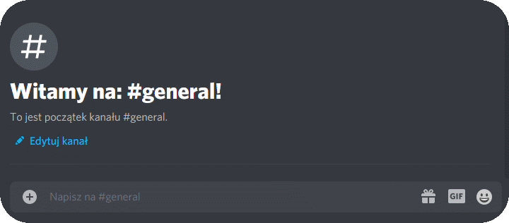
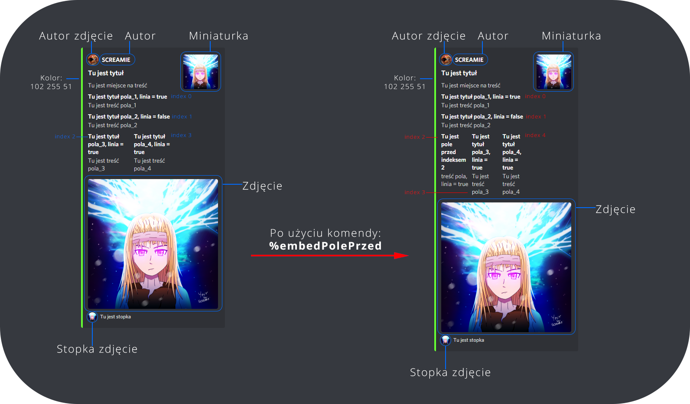
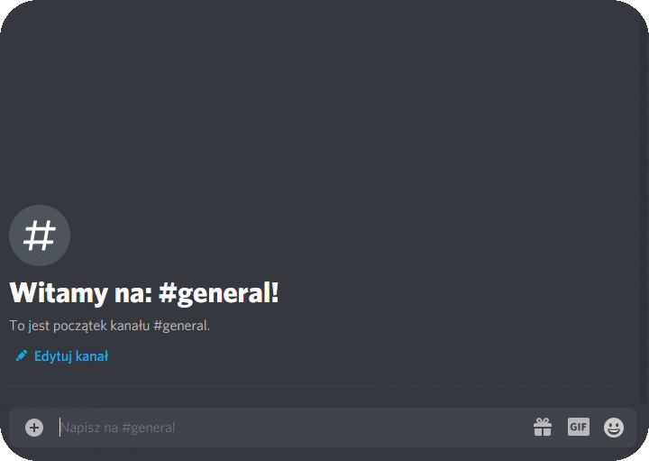
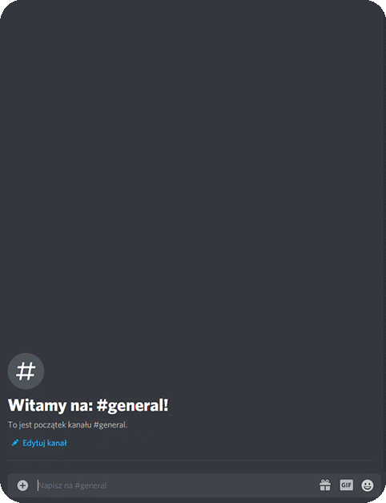
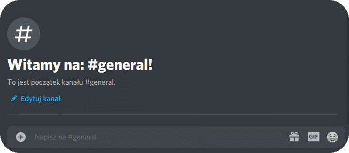

### Twórca: ***SCREAMIE#9946***  
[Zaproś Ymir na serwer](https://discord.com/oauth2/authorize?client_id=829256206170062888&permissions=8&scope=bot)
-------------------------------------------------------------------------------------

## Spis komend:  
- [Komendy podstawowe](#komendy-podstawowe)
- [Embed Kreator](#embed-kreator)
- [Moderacja](#moderacja)
- [Rola za reakcje (Role Reaction)](#role-za-reakcje-na-wiadomośćrole-reaction)
- [Konfiguracja serwera](#konfiguracja-serwera)
- [Przypomnienia](#przypomnienia)
- **Gry:**
  - [Wisielec](#gra-wisielec)
- [Obliczenia](#obliczenia)
- **Sieci komputerowe:**
  - [Tworzenie kodów CRC](#tworzenie-kodów-crc)
  - [Sprawdzanie sumy IP](#sprawdzanie-sumy-ip)
- [System kontroli kanałów Ymir | *BETA TESTY*](#system-kontroli-kanałów-ymir-beta-testy)  
-------------------------------------------------------------------------------

| Ymir_help | pokazuje aktualny prefix na serwerze |
| :--- | :--- |

### Komendy podstawowe:  

| Komenda | Dodatkowe opcje | Opis | Wymagana permisja |
| :--- | :--- |:--- | :--- |
| **%zmienprefix** *prefix* | | ustawia prefix bota na *prefix* | administrator |
| **%hi** | | wysyła informacje o bocie | |
| **%poke** *@user* | | wysyła wiadomość poke do wzkazanego użytkownika o ile nie jest botem, lub nie ma statusu "nie przeszkadzać" lub nie jest offline | |
| **%pokeALL** | | wysyła wiadomość do wszystkich użytkowników serwera o ile użytkownik nie jest offline i nie jest botem| administrator |
| **%forcepoke** *@user* | | wysyła wiadomość poke o ile dany użytkownik nie jest botem | administrator |
| **%say** *text* | | tworzy wpisany text w formie ramki, dodatkowo jeżeli jest to administrator to usuwa wiadomość z komendą | |
| **%sayRGB** *R* *G* *B* | | tworzy wpisany text w formie ramki o kolorze *RGB*, dodatkowo jeżeli jest to administrator to usuwa wiadomość z komendą | |  

[powrót](#spis-komend)  

-------------------------------------------------------------------------------------------------------------------------------------------------------------------

### Embed Kreator:

*Pamiętaj aby wywoływać komendy na tym samym kanale, gdzie stworzyłeś embed przy pomocy komendy* **%embed**  
***messageID*** odwołuje się do wiadomości embed stworzonej przez Ymir  

| Komenda | Dodatkowe opcje | Opis | Wymagana permisja |
| :--- | :--- |:--- | :--- |
| **%embed** | | towrzy wiadomość **embed**, na którą będziesz edytować | manage_messages |
| **%embedTytul** *messageID* *tytuł* | | edytuje tytuł wiadomości embed | menage_messages |
| **%embedTresc** *messageID* *treść* | | dodaje lub edytuje treść wiadomości embed | menage_messages |  

[powrót](#spis-komend)  

-------------------------------------------------------------------------------------------------------------------------------------------------------------------

### Moderacja:

| Komenda | Dodatkowe opcje | Opis | Wymagana permisja |
| :--- | :--- |:--- | :--- |
| **%clear** | **%clear** *n* | usuwa 1 wiadomość \| *n* wiadomości (max 200)| manage_messages |
| **%clearAV** *limit* *@user* | | usuwa tylko wiadomości wzkazanego *@user*, ***UWAGA*** *limit* to ilość wiadomości jakie bot ma sprawdzić i usunie w nich wiadomości autora *@user* a nie ile wiadomości @user ma usunąć (max 200 do sprawdzenia) | manage_messages |
| **%serverlogs** | **%serverlogs** *n* | wysyła w prywatnej wiadomości liczbę użytkowników oraz: 10 logów serwera \| *n* logów | administrator |
| **%dc** *@user* | | usuwa użytkownika z kanału głosowego | administrator |  

[powrót](#spis-komend)  

-------------------------------------------------------------------------------------------------------------------------------------------------------------------

### Role za reakcje na wiadomość(Role reaction):  

Ymir potrafi nadać użytkownikowi wzkazaną rolę, która jest przepisana do reakcji na wiadomość.
**Poradnik jak ustawić funkcję** ***rola za reakcje***:  
- stwórz wiadomość
- przygotuj ID wiadomości
- stwórz rolę
- umieść rolę ***Ymir*** powyżej stworzonej roli ( rekomendowane jest ustawienie Ymir jak najwyżej w hierarchii)
- przygotuj ID roli
- przygotuj emoji
- na kanale, na którym została stworzona wiadomość, wywołaj komendę **%dodajWiadomosc** *messageID* *emoji* *rolaID*
- jeżeli wszystko wykonałeś prawidłowo, Ymir wstawi reakcję z emotką wzkazaną w komendzie pod wzkazaną wiadomością
- gotowe!  
 
 
| Komenda | Dodatkowe opcje | Opis | Wymagana permisja |
| :--- | :--- |:--- | :--- |
| **%dodajWiadomosc** *messageID* *emoji* *rolaID* | | ustawia wiadomość wzkazaną przez *messageID* i dodaje do niej reakcję wzkazaną przez *emoji*. Następnie Ymir automatycznie doda reakcję do tej wiadomości i osoba, która kliknie w tą reakcje, otrzyma rolę wzkazaną przez *rolaID*. ***UWAGA!*** pamiętaj o poprawnym wpisaniu ID wiadomości oraz ID roli. *Dozwolone custom emotki* ***KOMENDA MUSI BYĆ WYWOŁANA NA TYM SAMYM KANALE CO WZKAZYWANA WIADOMOŚĆ*** | administrator |
| **%usunEmotke** *messageID* *emoji* | | usuwa przypisanie *emoji* z wiadomości wzkazanej przez *messageID* . Poprawne wykonanie komendy skutkuje usunięciem reakcji. ***KOMENDA MUSI BYĆ WYWOŁANA NA TYM SAMYM KANALE CO WZKAZYWANA WIADOMOŚĆ*** | administrator |  

[powrót](#spis-komend)  

-------------------------------------------------------------------------------------------------------------------------------------------------------------------

### Konfiguracja serwera:  

| Komenda | Dodatkowe opcje | Opis | Wymagana permisja |
| :--- | :--- |:--- | :--- |
| **%dodajRole** *nazwa_roli* | | Interaktywny kreator, który poprowadzi Cię przez proces tworzenia rangi | administrator |
| **%zbudujserwer** | | automatycznie tworzy podstawowe kanały i rangi na serwerze | administrator |
| **%zbudujtext** *nazwa* | **%zbudujtext** *nazwa* *kategoria* | tworzy kanał tekstowy *nazwa* \| dodatkowo tworzy kategorię *kategoria* i go tam umieszcza | administrator |
| **%dodajtext** *nazwa* *kategoria* |  | tworzy kanał tekstowy *nazwa* i umieszcza go w kategori *kategoria*| administrator |
| **%zbudujvoice** *nazwa* | **%zbudujvoice** *nazwa* *kategoria* | tworzy kanał głosowy *nazwa* \| dodatkowo tworzy kategorię *kategoria* i go tam umieszcza | administrator|
| **%dodajvoice** *nazwa* *kategoria* |  | tworzy kanał głosowy i umieszcza go w kategori *kategoria* | administrator |
| **%ustawPowitanie** | | Ymir zacznie wysyłać wiadomość powitalną po tym jak nowy użytkownik wejdzie na serwer ***UWAGA!*** musi być ustawiony kanał systemowy | administrator |
| **%ustawPowitanieKanal** | | Ymir zacznie wysyłać wiadomość powitalną na kanale, którym została wywołana komenda | administrator |
| **%usunPowitanie** | | usuwa opcję wysyłania powitań przez Ymir | administrator |  

[powrót](#spis-komend)  

-------------------------------------------------------------------------------------------------------------------------------------------------------------------

### Przypomnienia:  

| Komenda | Dodatkowe opcje | Opis | Wymagana permisja |
| :--- | :--- |:--- | :--- |
| **%przypomnij** *dzień* *miesiąc* *rok* *treść* | | zapisuje przypomnienie na podaną datę i przy następnej zmianie z nieaktywnego na aktywny, w podanym dniu, bot wyśle wiadomość prywatną z *treść* (przypomnienie wyśle się tylko raz gdy nastąpi zmiana statusu) ***UWAGA 1*** jeżeli jesteś na dwóch serwerach gdzie jest Ymir, to bot wyśle podwójnie przypomnienie w tym samym czasie ***UWAGA 2*** możesz mieć tylko jedno przypomnienie! użycie drugi raz tej komendy, nadpisze aktualne przypomnienie| |
| **%usunprzypomnienie** | | usuwa przypomnienie | |  

**twórca bota nie ponosi odpowiedzialności za zamieszczane treści*  

[powrót](#spis-komend)  

-------------------------------------------------------------------------------------------------------------------------------------------------------------------

### Gra wisielec:  
**Twórcy:** ***Magdalena#6689***, ***SCREAMIE#9946***  

| Komenda | Dodatkowe opcje | Opis | Wymagana permisja |
| :--- | :----- |:--- | :--- |
| **%egzekucja** | | rozpoczyna nową grę na danym kanale tekstowym - jedna gra może być grana na jednym kanale ale ilość grających osób na tym kanale jest nieograniczona| |
| **%zgaduje** *litera* | **%zgaduje** *słowo* | sprawdza czy dana *litera* pasuje \| czy dane *słowo* jest rozwiązaniem | |  

[powrót](#spis-komend)  

-------------------------------------------------------------------------------------------------------------------------------------------------------------------

### Obliczenia:
**Twórcy:** ***Tomasz#0711***, ***SCREAMIE#9946***
| Komenda | Dodatkowe opcje | Opis | Wymagana permisja |
| :--- | :----- |:--- | :--- |
| **%decimalBIN** *liczba* | | zwraca zamienioną *liczbę* dziesiętna na binarną i pokazuje wizualizacje procesu liczenia| |
| **%hexaBIN** *liczba* | | zwraca zamienioną liczbę hexadecymalną na binarną | |
| **%ipBIN** *adres* | | zwraca adres w postaci binarnej. Dla przykładu: **%ipBIN** *192.168.2.1* | |
| **%obliczAdresSieci** *adresIP* *maska* | | oblicza adres sieci, adres rozgłoszeniowy, długość maski, pierwszy i ostatni adres użyteczny oraz liczbę hostów i liczbę adresów ip dla podanego *adresIP* i *maska* | |
| **%obliczMaskeSieci** *ilość_urządzeń* | | oblicza maskę oraz długość maski dla podanej ilości urządzeń ***UWAGA*** adreś sieci i adres rozgłoszeniowy jest wliczony do obliczeń więc podajesz tylko samą liczbę urządzeń | |  

[powrót](#spis-komend)  

-------------------------------------------------------------------------------------------------------------------------------------------------------------------

### Tworzenie kodów CRC:

| Komenda | Dodatkowe opcje | Opis | Wymagana permisja |
| :--- | :----- |:--- | :--- |
| **%allCRC** | | pokazuję listę dzielników CRC | |
| **%CRC** *ciąg_bitowy* *n_dodanych_bitów* *dzielnik* | | zwraca graficzne rozwiązanie wartości kodu CRC | |
| **%randomCRC** *ilu_bitowy* *dzielnik* *wynik_w_bitach* | | zwraca graficzne rozwiązanie randomowego ciagu N-bitów pasującego do danego kodu CRC | |  

[powrót](#spis-komend)  

-------------------------------------------------------------------------------------------------------------------------------------------------------------------

### Sprawdzanie sumy IP:

| Komenda | Dodatkowe opcje | Opis | Wymagana permisja |
| :--- | :----- |:--- | :--- |
| **%sumakontrolnaip** *ip_hexadecymal* | | zwraca sumę kontrolną w bitach i hexadecymalną oraz pokazuje proces liczenia | |
| **%weryfikacjasumykontrolnejip** *ip_hexadecymal* | | zwraca wynik sprawdzenia sumy kontrolnej ip oraz pokazuje proces liczenia | |  

[powrót](#spis-komend)  

-------------------------------------------------------------------------------------------------------------------------------------------------------------------

### System Kontroli Kanałów Ymir ***BETA TESTY***

***Jak to działa?***  

Po dodaniu danego kanału do bota, Ymir zacznie automatycznie reagować na dane zachowania na tym kanale.
Dla przykładu: administrator serwera ustawia kontrole na "zakaz przeklinania". Gdy ktos użyje wulgaryzmu,
Ymir automatycznie usunie taką wiadmość i wyśle komunikat o zakazie używania wulgaryzmów.  

***Czy jest bezpieczne?***  

Ymir przechowuje jedynie informacje o ID kanału oraz o przypisanej do niego permisji.
Także możesz spać spokojnie! Ymir nie będzie śledzić tego, co dziś jadłeś na śniadanko! :)  

**Przechowywane informacje:**  
-ID kanału serwera Discord  
-ID serwera Discord

**KOMENDY:**  

| Komenda | Dodatkowe opcje | Opis | Wymagana permisja |
| :--- | :----- |:--- | :--- |
| **%dodajkontrole** | | dodaje ten kanał do kontroli i domyślnie ustawia kontrolę na: zakaz przeklinania | administrator |
| **%usunkontrole** | | usuwa wszystkiego kontrole z tego kanału | administrator |
| **%infokontrola** | | wyświetla informacje o ustawieniach kontroli | administrator |
| **%kontrola** *permisja* | | ustawia kontrole na dane permisje | administrator |  

***Permisje***  (permisje można łączyć np.: **%kontrola** *ASL*)
| Permisja | Opis | 
| :--- | :--- |
| **A** | zakaz używania wulgaryzmów |
| **L** | zakaz wysyłania linków |
| **S** | zakaz SPAMU (agresywna) |  

***UWAGA!!*** Zakaz SPAMU jest kontrolą bardzo agresywną. Jeżeli odstęp między wiadomościami tego samego użytkownika będzię mniejszy niż 20 sekund, Ymir uzna to za spam i 
wyśle ostrzeżenie! Po czwartym ostrzeżeniu ( poza permisją administrator) użytkownik zostanie wyrzucony z serwera!

[powrót](#spis-komend)  

-------------------------------------------------------------------------------------------------------------------------------------------------------------------

