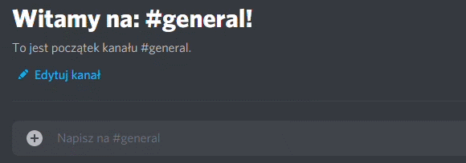
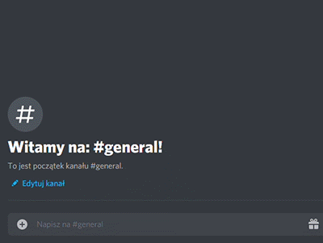
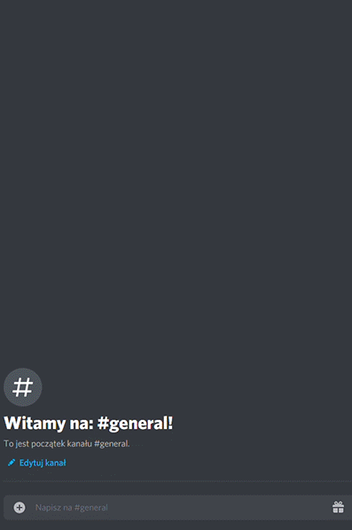
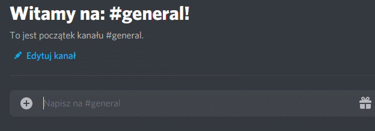

# Dokumentacja Discord Bota Ymir
### ***SCREAMIE#9946***

| Ymir_help | pokazuje aktualny prefix na serwerze |
| :--- | :--- |

#### Komendy podstawowe:  

| Komenda | Dodatkowe opcje | Opis | Wymagana permisja |
| :--- | :--- |:--- | :--- |
| **%hi** | | wysyła informacje o bocie | |
| **%poke** *@user* | | wysyła wiadomość poke do wzkazanego użytkownika | |
| **%say** *text* | | tworzy wpisany text w formie ramki | |
| **%zmienprefix** *prefix* | | ustawia prefix bota na *prefix* | administrator |
| **%clear** | **%clear** *n* | usuwa 1 wiadomość \| *n* wiadomości | administrator |
| **%serverlogs** | **serverlogs** *n* | wysyła w dm 10 logów serwera \| *n* logów | administrator |
| **%dc** *@user* | | usuwa użytkownika z kanału głosowego | administrator |

#### Konfiguracja serwera:  
| Komenda | Dodatkowe opcje | Opis | Wymagana permisja |
| :--- | :--- |:--- | :--- |
| **%zbudujserwer** | | automatycznie tworzy podstawowe kanały i rangi na serwerze | administrator |
| **%zbudujtext** *nazwa* | **%zbudujtext** *nazwa* *kategoria* | tworzy kanał tekstowy *nazwa* \| dodatkowo tworzy kategorię *kategoria* i go tam umieszcza | administrator |
| **%dodajtext** *nazwa* *kategoria* |  | tworzy kanał tekstowy *nazwa* i umieszcza go w kategori *kategoria*| administrator |
| **%zbudujvoice** *nazwa* | **%zbudujvoice** *nazwa* *kategoria* | tworzy kanał głosowy *nazwa* \| dodatkowo tworzy kategorię *kategoria* i go tam umieszcza | administrator |
| **%dodajvoice** *nazwa* *kategoria* |  | tworzy kanał głosowy i umieszcza go w kategori *kategoria* | administrator | 

#### Obliczenia:
| Komenda | Dodatkowe opcje | Opis | Wymagana permisja |
| :--- | :----- |:--- | :--- |
| **%decimalBIN** *liczba* | | zwraca zamienioną *liczbę* dziesiętna na binarną i pokazuje wizualizacje procesu liczenia| |
| **%hexaBIN** *liczba* | | zwraca zamienioną liczbę hexadecymalną na binarną | | 

#### Tworzenie kodów CRC:

| Komenda | Dodatkowe opcje | Opis | Wymagana permisja |
| :--- | :----- |:--- | :--- |
| **%allCRC** | | pokazuję listę dzielników CRC | |
| **%CRC** *ciąg_bitowy* *n_dodanych_bitów* *dzielnik* | | zwraca graficzne rozwiązanie wartości kodu CRC | |
| **%randomCRC** *ilu_bitowy* *dzielnik* *wynik_w_bitach* | | zwraca graficzne rozwiązanie randomowego ciagu N-bitów pasującego do danego kodu CRC | |

#### Sprawdzanie sumy IP:

| Komenda | Dodatkowe opcje | Opis | Wymagana permisja |
| :--- | :----- |:--- | :--- |
| **%sumakontrolnaip** *ip_hexadecymal* | | zwraca sumę kontrolną w bitach i hexadecymalną oraz pokazuje proces liczenia | |
| **%weryfikacjasumykontrolnejip** *ip_hexadecymal* | | zwraca wynik sprawdzenia sumy kontrolnej ip oraz pokazuje proces liczenia | |

#### System Kontroli Kanałów Ymir ***BETA TESTY***

***Jak to działa?***  
Po dodaniu ddanego kanału do bota, Ymir zacznie automatycznie reagować na dane zachowania na tym kanale.
Dla przykładu: administrator serwera ustawia kontrole na "zakaz przeklinania". Gdy ktos użyje wulgaryzmu,
Ymir automatycznie usunie taką wiadmość i wyśle komunikat o zakazie używania wulgaryzmów.  

***Czy jest bezpieczne?***  

Ymir przechowuje jedynie informacje o ID kanału oraz o przypisanym do niego permisji.
Także możesz spać spokojnie! Ymir nie będzie śledzić tego, co dziś jadłeś na śniadanko! :)  

**KOMENDY:**  

| Komenda | Dodatkowe opcje | Opis | Wymagana permisja |
| :--- | :----- |:--- | :--- |
| **%dodajkontrole** | | dodaje ten kanał do kontroli i domyślnie ustawia kontrolę na: zakaz przeklinania | administrator |
| **%usunkontrole** | | usuwa wszystkiego kontrole z tego kanału | administrator |
| **%infokontrola** | | wyświetla informacje o ustawieniach kontroli | administrator |
| **%kontrola** *permisja* | | ustawia kontrole na dane permisje | administrator |  

***Permisje***  
| Permisja | Opis | 
| :--- | :--- |
| **A** | zakaz używania wulgaryzmów |
| **L** | zakaz wysyłania linków | 
